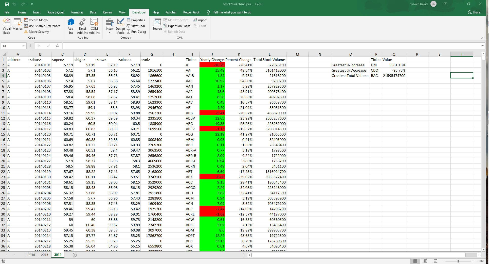
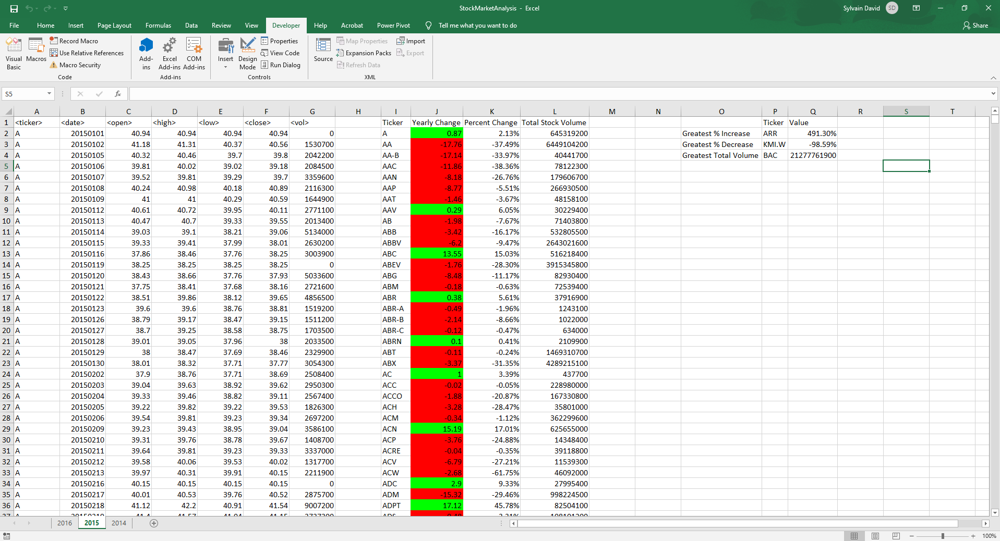
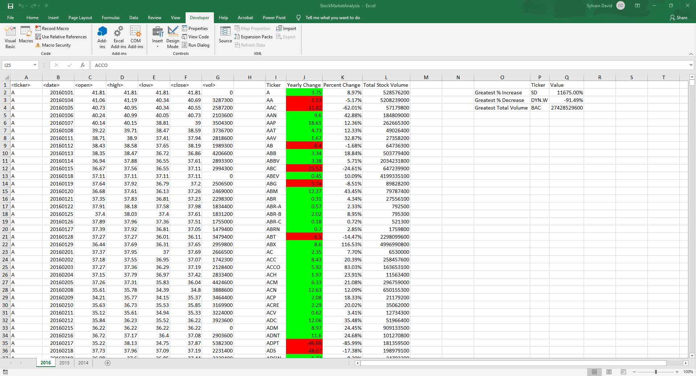

# VBA-Challenge
## Table of Content ##
*Overview,*
*Challenge*
*2014 Stock Market Analysis Screenshot*
*2015 Stock Market Analysis Screenshot*
*2016 Stock Market Analysis Screenshot*

## Overview ##
Create a script that will loop through all the stocks for one year and output the following information.
* The ticker symbol.
* Yearly change from opening price at the beginning of a given year to the closing price at the end of that year.
* The percent change from opening price at the beginning of a given year to the closing price at the end of that year.
* The total stock volume of the stock

It should also have conditional formatting that will highlight positive change in green and negative change in red.

## Challenge ##
Return the stock with the "Greatest % increase", "Greatest % decrease" and "Greatest total volume".

### 2014 Stock Market Analysis Screenshot ###

### 2015 Stock Market Analysis Screenshot ###

### 2016 Stock Market Analysis Screenshot ###

## Technologies used ##
* Excel
* VBA
  
## Authors ##
Sylvain David - Data Analytics Bootcamp - Vanderbilt University - 2020